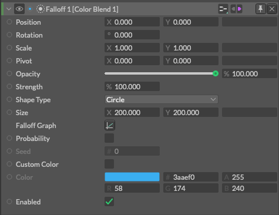
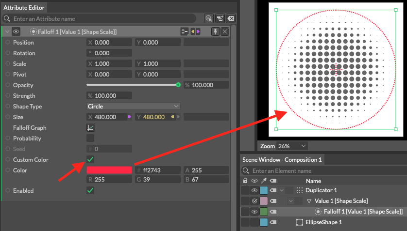
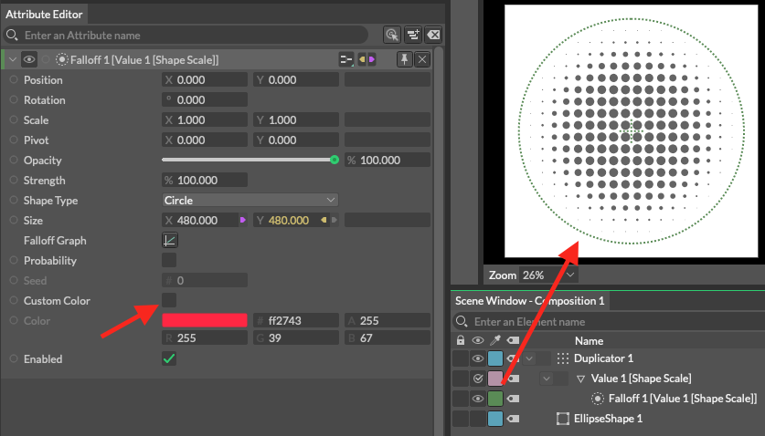
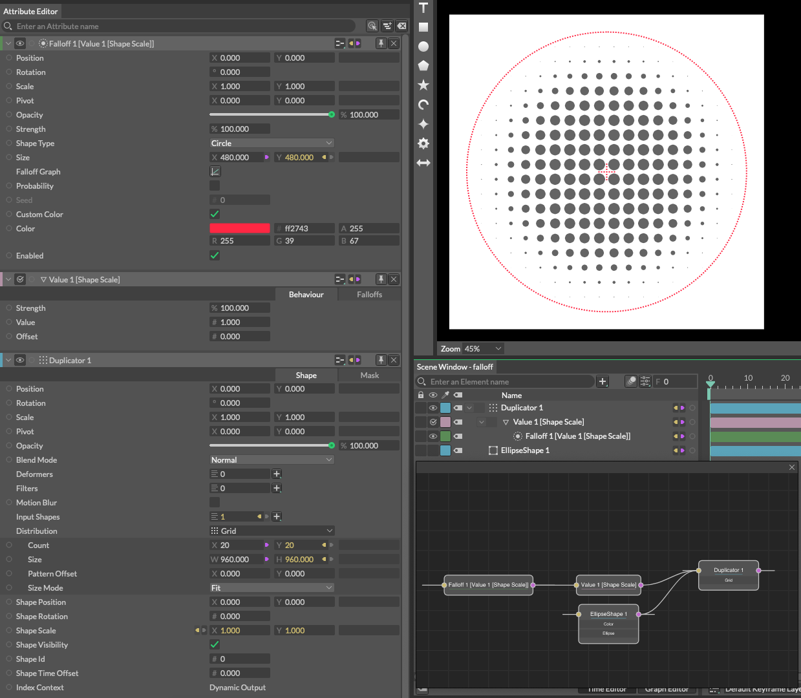

# Falloff -減衰-

> フォールオフ

https://docs.cavalry.scenegroup.co/elements/atoms/falloff

## 前書き

Falloffは、ほとんどのビヘイビアの強さを減衰させるのに使用できます。デフォルトでは、減衰を中心で1の値を出力し、端では0になります。この値は接続されているビヘイビアの強度の乗数として使用され、グラフは値が「落ちる(減衰する)」速度を決定するのに使用できます。

## UI

### 共通属性(Common Attributes +)

**Strength** - 減衰の全体の強さ

**Shape Type**:減衰を適用させるシェイプを三つの形状から選択します

- **Circle** - 減衰を適用するシェイプが円形で、放射状にサンプリングされます。
- **Rectangle** - 減衰を適用するシェイプが長方形で、xとyでサンプリングされます。
- **Linear** - 減衰を適用するシェイプが線形で、一次元でサンプリングされます。

**Size** - 減衰を適用するシェイプのサイズを設定します。

**Falloff Graph** - 1から0の数値の分布をグラフで指定します。操作方法はグラフ属性を参照してください。

**Probability**(確率) - Falloffの値の1〜0を使用して、1または0（真または偽）の値を生成します。例えば、Falloffの値が0.5であれば、50%の確率で1を得ることができます。

**Seed** - Probability(確率)にチェックを入れると入力できるようになります。この値を変更すると確率に影響を与えます。

**Custom Color** - チェックを入れると、Falloffのシェイプ表示のカラーを設定された値に変更して使用できます。
チェックを外すと、シーンウィンドウのラベルカラーが使用されます。

**Color** - Falloffの色を設定します。

**Enabled** - チェックを外すと、Falloffは1の値を出力します（結果はFalloffが存在しない場合と同じです）

> Falloffは、シーンウィンドウで、選択して、右クリックのコンテキストメニューで「Disable(Enable) Falloff(s)」で無効化(有効化)を選択できます。
>
> 
>
> ビヘイビアでレイヤモードを使用するためには、共通属性（Falloffタブ）を参照してください。

## 使用例

[falloff_sample.cv](falloff.assets/falloff_sample.cv)

Staggerを使用せず、Falloffの減衰をValue変換して円形にシェイプサイズを減衰させています。

