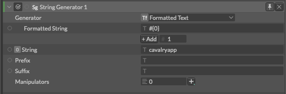
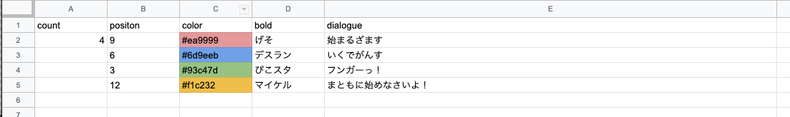
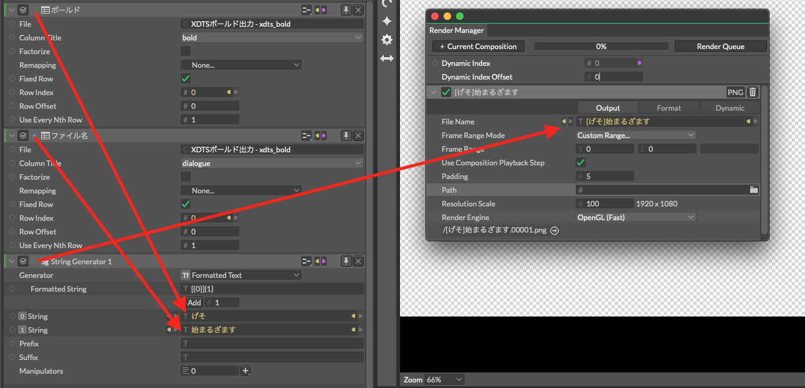

# Formatted Text Generator -フォーマット化されたテキスト-

> フォーマッテド　テキスト　ジェネレーター

https://docs.cavalry.scenegroup.co/elements/atoms/string-generator/formatted-text-generator

配列からカスタム文字列を作成します。
なおこれはString Generatorの種類の一つです。

**Formatted String** - 文字列のフォーマットを記述します。インデックスを参照するには、`{<indexNunber>}`を使用します。

**+ Add** - 配列(インデックス)を追加します。

**0:String** - 配列の一番初めのインデックスです。Addボタンを押すことで配列1,2...と増えていきます。

> Formatted Stringの欄に「{0}」を入力すると、0:Stringのインデックスの内容に置き換えられます。
> 例えば、0:String に 「Crazy」 が含まれていた場合、Formatted Stringに「Here's to the {0} ones.」を入力すると、「Here's to the crazy ones.」 が返ってきます。

> インデックスは文字列を入力として受け入れます。値を接続するには、値文字列ジェネレータを使用します。

> インデックス化されていない項目 (空の中括弧) は、文字列の中での位置に基づいて列挙されます。
> 例えば「{}{}{}」と記述された場合、「{0}{1}{2}」と解釈します。
>
> これは、同じ文字列の中にインデックス付きのエントリとインデックスなしのエントリが存在する場合にも当てはまります。
> 例えば「{2}{}{1}{}」と記述された場合、「{2}{0}{1}{1}」と解釈します。

### 使用例

Googleスプレッドシートで以下のような表を作成します。

ファイル名を「[{bold}]{dialogue}」という状態で出力したい場合、以下のようなアトリビュートを構成します。

