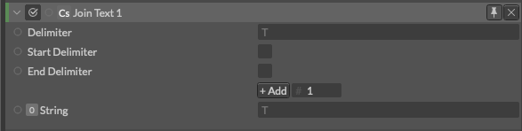

# Join Text Manipulator -テキストの連結-

> ジョイン　テキスト　マニピュレーター

https://docs.cavalry.scenegroup.co/elements/atoms/string-manipulator/join-text-manipulator

文字列を連結します
なおこれはString Manipulatorの種類の一つでもあります。

**Delimiter**(区切り文字) - 文字列の間に表示される文字を入力します。

**Start Delimiter** - 文字列の頭に区切り文字を追加します。

**End Delimiter** - 文字列の尻に区切り文字を追加します。

**0:String** - 配列の最初の文字列です。+Addボタンで追加することができます。