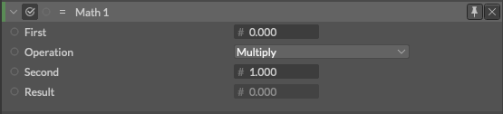
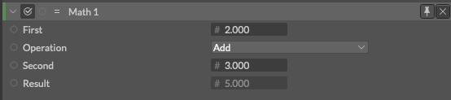
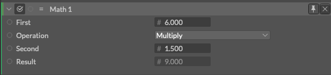

# Math -数学-

> マス

https://docs.cavalry.scenegroup.co/elements/atoms/math

単一チャネルを持つ属性(アトリビュート)に対して、簡単な数学的操作を行います。

**First** - 最初の被演算子の属性(アトリビュート)として接続します。

**Operation** - 適用する数学的操作を選択します。

**Second** - ２つ目の被演算子の属性(アトリビュート)として接続します。

**Result** - 操作の結果 (読み取り専用 - この結果が、出力されるID(値)として使用されます)

> Math は単一チャネルを出力するので、他の単一チャネルに接続するために使用できます。位置(Position)のように2つのチャンネル[x,y]を持つ属性の場合は、[Math2](math2.md)を使用します。

## 使用例

2 + 3 = 5 を求めたい場合……

6 * 1.5 = 9 を求めたい場合……

### Operationで選択できる数学的操作(演算子や数式)

- Add
  - 加算(足し算)
- Subtract
  - 減算(引き算)
- Multiply
  - 乗算(掛け算)
- Divide
  - 除算(割り算)
- Modulus
  - 剰余(余り)
- FModulus
- Max
  - 最大
- Min
  - 最小
- Average
  - 平均
- Power
  - べき乗
- Square Root
  - 平方根
- Sine
  - 正弦
- Cosine
  - 余弦
- Floor
  - 床関数
- Ceiling
  - 天井関数
- Round
  - 端数処理
- Absolute
  - 絶対値