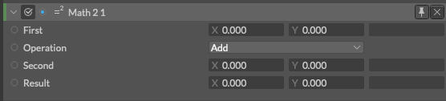

# Math2 -数学x2-

> マス ツー

https://docs.cavalry.scenegroup.co/elements/atoms/math2

２つのチャネルを持つ属性(アトリビュート)に対して、簡単な数学的操作を行います。

**First** - 最初の被演算子の属性(アトリビュート)として接続します。

**Operation** - 適用する数学的操作を選択します。

**Second** - ２つ目の被演算子の属性(アトリビュート)として接続します。

**Result** - 操作の結果 (読み取り専用 - この結果が、出力されるID(値)として使用されます)

### 使用例

詳しくは[Math](math.md)に記載があります。