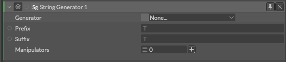
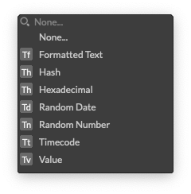

# String Generator -文字列発生器-

> ストリングジェネレーター

https://docs.cavalry.scenegroup.co/elements/atoms/string-generator

手続き的に生成されたテキストを作成します

**Generator** - ジェネレーターのタイプを選択します。

- [Formatted text](formattedtextgenerator.md) - フォーマット化されたテキスト
- Hash - ハッシュ
- Hexadecimal - 16進数
- Random Date - ランダムな日付
- Random Number - 乱数
- Timecode - タイムコード(00:00:00:00)
- Value - 値

**Prefix** - 値の前に表示する文字を設定します。

**Suffix** - 値の後ろに表示する文字を設定します。

**Manipulators** - String Manipulatorを接続します。

