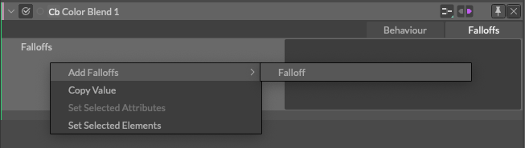
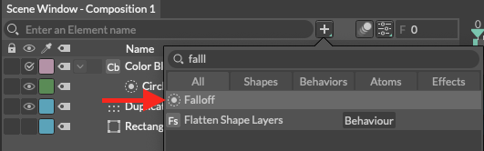
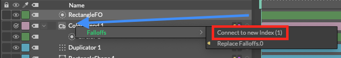
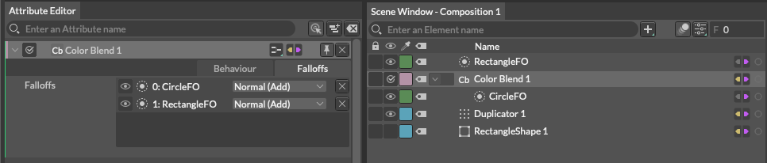
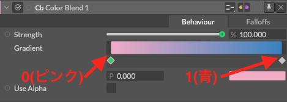
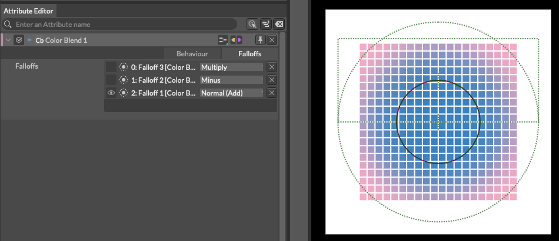
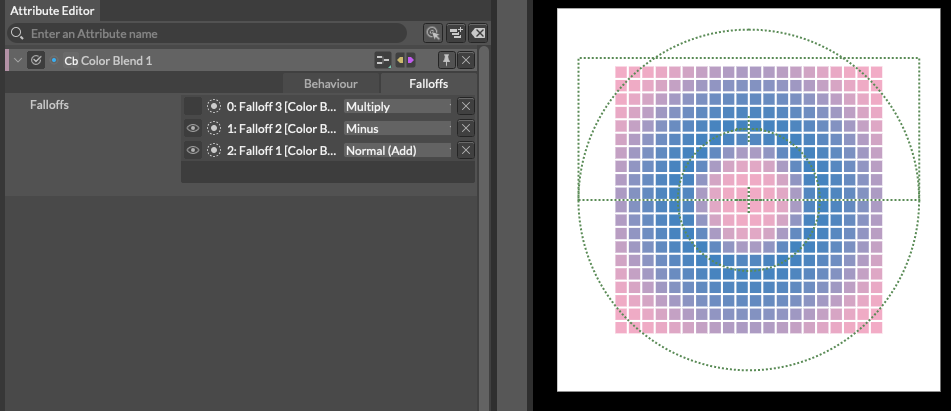
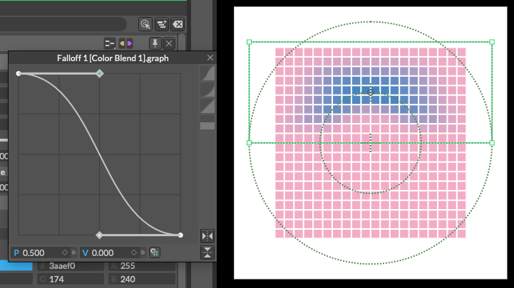
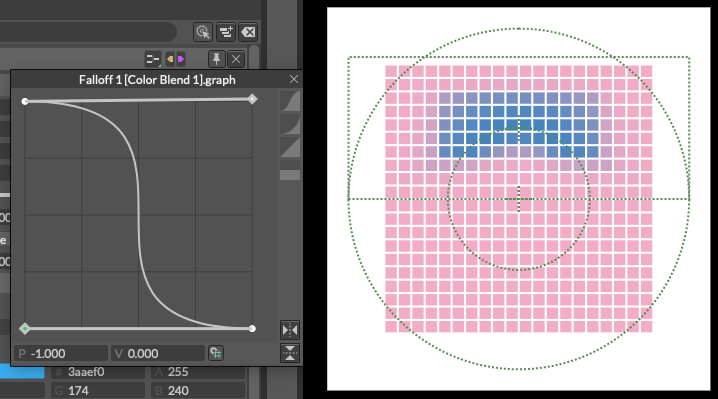
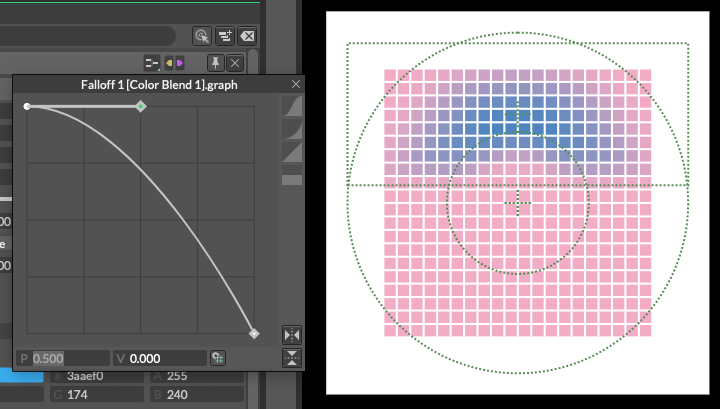

# Common Attributes (Behaviours) -共通属性(ビヘイビア)-

> コモンアトリビューツ(ビヘイビア)

https://docs.cavalry.scenegroup.co/elements/behaviours/common-attributes-behaviours  

### Behaviours

**Strength(ストリング)** - (属性に対して)動作の強度を入力します。

>  多くのビヘイビアには、以下のグラフ・ウィジェットが含まれていますが、すべてのビヘイビアには含まれていません。

**Graph(グラフ)** - アイコンをクリックすると、グラフウィジェットがポップアップします。これは、ビヘイビアの効果をグラフでコントロールすることができます。
詳しくは「USER INTERFACE/Widgets/**Graph Attribute**」を参照してください。

### Falloffs(減衰)

ビヘイビアに対して、減衰効果の追加と設定を行うためのリストです。

Falloffs(減衰)エレメンツを追加する

- Falloffsの行を右クリックして、**Add Falloffs**(Falloffsの追加) > **Falloffs**を選択する

  

- 既存のFalloffsを接続します。

どちらで接続しても各ビヘイビアのFalloffタブにリストとして追加されます。

**表示アイコン** (目のマーク) - Falloffを有効/無効にします

**Layer Mode** - 各Falloffのレイヤーモードを設定します。

- **Normal (Add)** - [！]オフィシャルが空欄
- **Min.** - [！]オフィシャルが空欄
- **Max.** - [！]オフィシャルが空欄
- **Minus** - [！]オフィシャルが空欄
- **Multiply** - [！]オフィシャルが空欄
- **Screen** - [！]オフィシャルが空欄
- **Overlay** - [！]オフィシャルが空欄

ドラッグ＆ドロップするだけでリストの並び替えができます。

> 各レイヤーはその下のレイヤーの結果に追加されるので、レイヤーの順番は非常に重要です。例えば、Falloffsエレメンツを3つ持っているとします。
> 最初の (下の) Falloffsエレメンツは Normal (Add) に設定されている必要があり、そうしないと加算/減算する値がありません。
> 2番目のFalloffsエレメンツは下のFalloffsエレメンツに作用します。
> 3つ目のFalloffsエレメンツは、その下のFalloffsエレメンツの結果に基づいて行動します。

下の例では、3つのFalloffがColor Blendに接続されています。

Color Blendは 0 の値をピンク (グラデーションの左側の色) に、 1 の値を青 (グラデーションの右側の色) に変換します。

- Falloff 1はサークルであり、レイヤーモードはノーマル（追加）に設定されています。
- Falloff 2はサークルは小さくなっているが、レイヤーモードはマイナスに設定されている。
- Falloff 3は長方形で、レイヤーモードは「乗算」に設定されています。

- Falloff 1(Normal(Add))は1から0（中心から端に向かって）の値をシンプルに渡すだけで、カラーブレンドは青（1）からピンク（0）に変換します。

  

- Falloff 2(Minus)にはFalloff 1の値からその値を差し引いています。中央のFalloff 2はどちらも1の値を持っているので、`1+1=0`となり、カラーブレンドがピンク（0）が適用されます。

  

- Falloff 3(Multiply)はその値を使ってFalloff 2の結果を掛け合わせています。矩形の内側では1の値を、外側では0の値を渡しています。`Anything x 0 = 0`なので、矩形の外側はすべてピンク（0）になります。矩形内の値は1を掛けているので、変化はありません。（グラフを使って掛け算される数値を調整することもできます）

## サンプルファイル

[falloffs_sample.cv](_commonattributes.assets/falloffs_sample.cv)