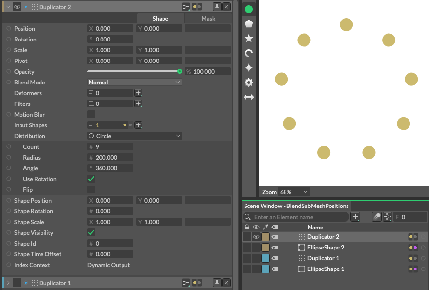

# Blend Sub Mesh Positions -サブメッシュの場所などをブレンドする-

> ブレンドサブメッシュポジションズ

https://docs.cavalry.scenegroup.co/elements/behaviours/blend-sub-mesh-positions

サブメッシュとサブメッシュの間をブレンド補完します。

### 共通属性(Common Attributes +)

**Blend** - 宛先シェイプのパス(Destination Shape)に沿う度合いの割合(%)。

**Destination Shape**(宛先シェイプ) - ブレンドする際、宛先になるシェイプを接続します。

**Time Offset** - シェイプに沿う時間をオフセット(ずらし)します。

### 使用例

1. Ellipse(円形)シェイプを作成します。
2. Radius(半径)をW=20、H=20に設定します。
3. 円形シェイプを選択し、デュプリケーターをAlt+クリックして複製します。(Duplicator1)
4. 1と2の操作をもう一度繰り返し、Duplicator2を作成します。
   
5. Duplicator1をGrid(Count3,3)に設定します。
   
6. Duplicator2をCircleに設定します。
7. Duplicator2のCountを9にします。
   
8.  Blend Sub Mesh Positionsのビヘイビアを追加します。
9. duplicator2をblendSubMeshPostionのdestinationShapeに接続します。
   
10. blendSubMeshPostionをDuplicator1のdeformersに接続します。
    
11. Duplicator2を非表示にします。
12. Blend Sub Mesh PositionのBlendの数値を動かすと動作します。
    

13. Duplicator2のShape ScaleをX=2.5、Y=2.5にします。そうすることで終点のサイズを変えることもできます。

### サンプルファイル

 [blendsubmeshpositions_sample.cv](blendsubmeshpositions.assets/blendsubmeshpositions_sample.cv) 