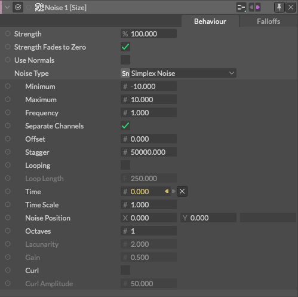

# Noise -雑音-

> ノイズ

https://docs.cavalry.scenegroup.co/elements/behaviours/noise

Shapesを変形させたり、値を生成するためのノイズパターンを生成します。

### 共通属性(Common Attributes +)

**強さは0(ゼロ)にフェードアウト** - チェックされている場合、強度(Falloffsを含む)は0と結果の間で補間されます。チェックを外すと、最小値と最大値の間を補間します。

**法線を使用** - チェックされている場合、変形はシェイプの法線に基づいて行われます。チェックを外すと、点はシェイプの中央から拡大縮小されます。デフォルマとして使用する場合にのみ関連します。

**Noise Type**は５種類あります。「None...」「Celeular Noise」「Cubic Noise」「Simplex Noise」「Value Noise」です。これから共通のノイズ属性と各ノイズの属性を説明します。

- **共通のノイズ属性** - すべてのノイズタイプには以下の属性があります。
  - **Minimum** - 出力する最小値を設定します。
  - **Maximum** - 出力する最大値を設定します。
  - **Frequency**（周波数）-  [！]オフィシャルが空欄
  - **Separate Channels** - x, y チャンネルに異なる値を出力します。
  - **Offset** - 出力に値を加算/減算します。
  - **Stagger** - [！]オフィシャルが空欄 
  - **Looping** - ループノイズを有効にするかどうかをチェックします。
  - **Loop Length** - ループが発生するフレーム数を設定します。
  - **Time** - この属性は自動的にコンプのフレーム番号に接続されます。静的なノイズが必要な場合は、この属性を外してください。
  - **Time Scale** - ノイズの速度を増減します。
  - **Noise Position** - ノイズの位置[x,y]を設定します。

- **Cellular Noise** - 細胞(セルラー)パターンのノイズを作成します。

  - **Common Noise Attributes +** - 共通のノイズ属性を持っています。

    **Jitter**(時間軸方向での信号波形の揺らぎ) - [！]オフィシャルが空欄

    **Distance Function:**(距離函数)

    - **Euclidean**(ユークリッド距離) - [！]オフィシャルが空欄
    - **Manhattan**(マンハッタン距離) - [！]オフィシャルが空欄
    - **Natural** - [！]オフィシャルが空欄

    **Cellular Type:**

    - **Cell Value** - [！]オフィシャルが空欄
    - **Noise Lookup** - [！]オフィシャルが空欄
    - **Distance 2** - [！]オフィシャルが空欄
    - **Distance 2 Add** - [！]オフィシャルが空欄
    - **DIstance 2 Sub** - [！]オフィシャルが空欄
    - **Distance 2 Mul** - [！]オフィシャルが空欄
    - **Distance 2 Div** - [！]オフィシャルが空欄

- **Cubic Noise** - 立方体パターンのノイズを作成

  - **Common Noise Attributes +** - 共通のノイズ属性を持っています。
  - **Octaves**(神聖幾何学) - [！]オフィシャルが空欄
  - **Lacunarity**(空隙性) - [！]オフィシャルが空欄
  - **Gain**(入力/出力比) - [！]オフィシャルが空欄
  - **Curl**(回転) - [！]オフィシャルが空欄
  - **Curl Amplitude**(回転の振幅) - [！]オフィシャルが空欄

  **Simplex**

  - **As per Cubic** - Cubic Noiseと同様

  **Value**

  - **As per Cubic** - Cubic Noiseと同様

