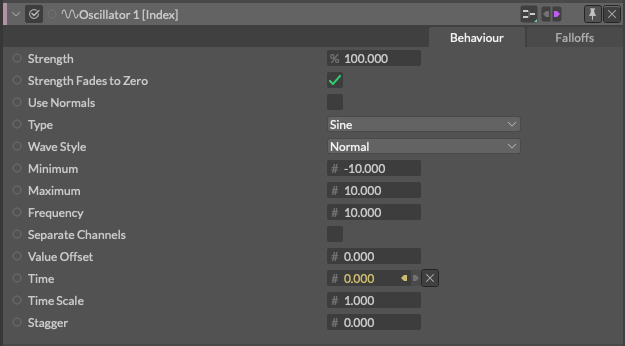

# Oscillator -発振器-

> オシレーター

https://docs.cavalry.scenegroup.co/elements/behaviours/oscillator

波形パターンを使用してシェイプを変形させ、影響を与えます。

### 共通属性(Common Attributes +)

**Strength Fade to Zero** - チェックすると、Strength（Falloffを含む）は0と結果の間で補間されます。チェックを外すと、最小値と最大値の間を補間します。

**Use Normals**(法線の使用) - チェックされている場合、変形はシェイプの法線に基づいて行われます。
チェックを外すと、シェイプの中央から拡大縮小されます。これはデフォーマーとして使用する場合にのみ関連します。

**Type**

- **Sine** - 三角関数のサイングラフを使用します。

- **Cosine** - 三角関数のコサイングラフを使用します。

- **Tangent** - 三角関数のタンジェントグラフを使用します。

  [！]座標グラフの資料を追加したい

**Wave Style**

- **Normal** - [！]オフィシャルが空欄
- **Square** - [！]オフィシャルが空欄
- **Triangle** - [！]オフィシャルが空欄
- **Sawtooth** - [！]オフィシャルが空欄

**Minimum** - 波形の高さの最小値を設定します。

**Maximum** - 波形の高さの最大値を設定します。

**Frequency**(周波数) - 波の周波数を設定します(数値が高いほどより波を作成します)。

**Separate Channels**(チャンネルの分離) - xとyの異なる値を生成します。

**Value Offset**(オフセット値) - 最小/最大値をオフセットします。 

**Time Scale** - 波形の周期に影響を与えます。

> オシレーターを、例えばPosition(位置)のXに接続した場合、タイムスケールを使用してオシレーションをスピードアップします。

**Stagger**(スタガー) - デュプリケーターと一緒に使用すると、重複した結果にStaggerを影響させます。