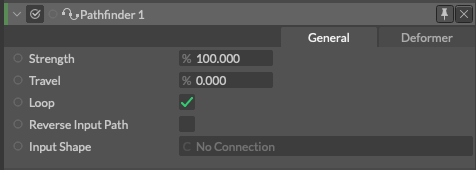

# Pathfinder -パスファインダー-

> パスファインダー

https://docs.cavalry.scenegroup.co/elements/behaviours/pathfinder

パスに沿って図形を移動または変形します。

### 共通属性(Common Attributes +)

### General

**Travel** - 入力シェイプの長さのパーセンテージに沿って、シェイプを移動します。

**Loop**(ループ) - チェックが入っている場合、パスの先頭に戻ってアニメーションを続けます。チェックが入っていない場合、入力シェイプの延長線の方向に移動します。

**Input Shape** - 沿わせたいシェイプを入力することで、接続したシェイプを配置/変形します。

### Deformer

**Taper Graph** - シェイプの長さに沿って、テーパー(先細り)を作成します。

**Path Offset** - シェイプを入力シェイプから離します。

**Flip** - シェイプをX軸に沿って反転させます。これは特にテキストに便利です。

### 使用例

