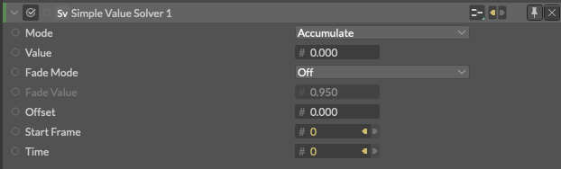

# Simple Value Solver -？？？-

> シンプル バリュー ソルバー

https://docs.cavalry.scenegroup.co/elements/behaviours/simple-value-solver

### 

**Mode** - 

- **Accumulate** - 各フレームに値を追加、累積していきます。(累積)
- **Highest** - 現在のフレームの値がこの値よりも高い場合は、それを維持します。(最高値)
- **Lowest** - 現在のフレームの値がこの値よりも低い場合、それを維持します。(最低値)
- **Velocity** - 速度[！]公式に記述がありません。

**Value** - 

**Fade Mode** - 値を持続(フェード値)させるか、初期値に戻すかを決定します。

- **Off** - フェード値を保持しません。
- **Multiply by Value** - 各フレームで、フェード値に基づいて値を乗算します。

**Fade Value** - ソルバーが「オフ」になった後、フェード値が初期値に戻る速度です（例：Falloffの外など）。値が低いほどフェードが速くなります。

**Offset** - 出力に値を加算/減算します。

**Start Frame** - デフォルトではコンポジションのスタートフレームに接続しています。

**Time** - デフォルトではコンポジションの時間の値に接続しています。

### 使用例

