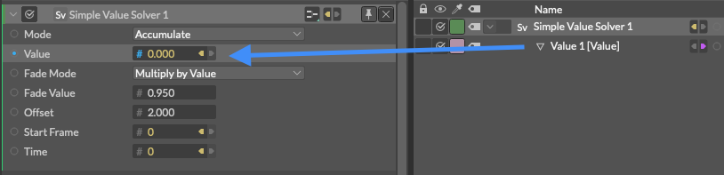

# Simple Value Solver -？？？-

> シンプル バリュー ソルバー

https://docs.cavalry.scenegroup.co/elements/behaviours/simple-value-solver

**Mode** - 

- **Accumulate** - 各フレームに値を追加、累積していきます。(累積)
- **Highest** - 現在のフレームの値がこの値よりも高い場合は、それを維持します。(最高値)
- **Lowest** - 現在のフレームの値がこの値よりも低い場合、それを維持します。(最低値)
- **Velocity** - 速度[！]公式に記述がありません。

**Value** - 

**Fade Mode** - 値を持続(フェード値)させるか、初期値に戻すかを決定します。

- **Off** - フェード値を保持しません。
- **Multiply by Value** - 各フレームで、フェード値に基づいて値を乗算します。

**Fade Value** - ソルバーが「オフ」になった後、フェード値が初期値に戻る速度です（例：Falloffの外など）。値が低いほどフェードが速くなります。

**Offset** - 出力に値を加算/減算します。

**Start Frame** - デフォルトではコンポジションのスタートフレームに接続しています。

**Time** - デフォルトではコンポジションの時間の値に接続しています。

### 使用例

1. Simple Value Solverを作成します。
2. フェードモードをMultiply by Valueに、オフセットを2に設定します。
   
3. アトリビュートエディタのSimple Value SolverのValueにValueのビヘイビアを追加します。
   
4. Valueのビヘイビアの数値を5にします。[！]公式では0.5ですが、辺の数を考えると5の間違いでは？？？
5. Falloffを作成して、Valueビヘイビアに追加します。
   
6. Pllygon Shape(多角形シェイプ)を作成します。
7. simpleValueSolverをpolygon Shapeのsidesへ接続します。
   
8. Polygon Shapeを⌥＋クリックでデュプリケートします。

Falloffをドラッグすると、Simple Value Solverのオフセットに入力した2＋Valueビヘイビアに入力した5の最大七角形の図形になり、減衰した外側がオフセットの2となり、二辺の多角形は存在しないので、図形が消えます。
ですので、オフセットを3に設定すると、Falloffの減衰した外側の図形が全て三角形になります。

例では色に影響を与えています。これを簡単に行うには次のように操作します。

1. もう一つ別のValueビヘイビアを作成します。
2. Simple Value SolverのValueに今追加したValueビヘイビアを追加します。
   
3. Valueビヘイビアのvalueをpolygon.materialColor.rに接続します。
   
4. ValueのStrengthの数値を上げます。(今回は3200)

この例では、Valueは単に乗算器として使用され、0～255（赤チャンネル）の範囲に目に見える効果を持つ値を設定しています。

### サンプルファイル

 [simplevaluesolver_sample.cv](simplevaluesolver.assets/simplevaluesolver_sample.cv) 