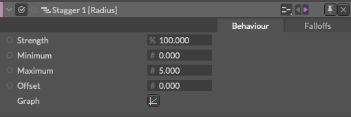
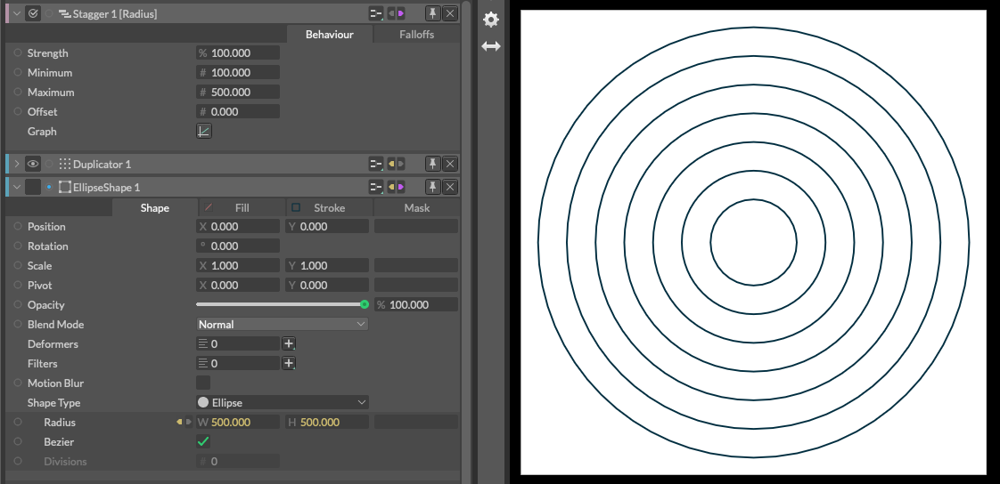

# Stagger -ズレ-

> スタッガー(段々、ずらして配置、重ならないようシフトさせる)

https://docs.cavalry.scenegroup.co/elements/behaviours/stagger  

最小値と最大値の間の連続した値を生成します。

### 共通属性(Common Attributes +)

**Minimum** - 最小値、または開始値('start' value)を設定します。

**Maximum** - 最大値、または終了値('end' value)を設定します。

**Offset** - 最小値と最大値に値を加算または減算(マイナス値)します。

**Graph** - 共通属性を参照してください

### 使用例

Radius(半径)にStaggerを適用して最小値から最大値まで段々の大きさの円をデュプリケーターにて生成。

