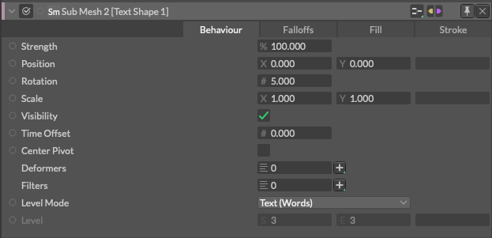
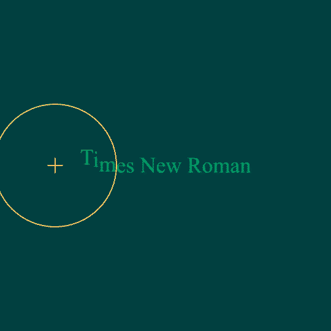

# Sub Mesh -分解した要素-

> サブメッシュ

https://docs.cavalry.scenegroup.co/elements/behaviours/sub-mesh

シェイプ内のサブメッシュにアクセスします。

Cavalryのメッシュは、その中に他のシェイプの階層を含むことができます。これらのメッシュを「サブメッシュ」と呼びます。この階層構造は、シーンウィンドウによく似たツリー構造で、シェイプの中にのみ存在します。

例えば、テキストは線、単語、文字で構成され、デュプリケータは入力された複数のシェイプ(Input Shapes)で構成され、SVGは何層ものレイヤーを持つことができます。サブメッシュの動作は、階層内のレベルを指定することで、これらの個々のメッシュにアクセスし、影響を与えます。

### 共通属性(Common Attributes +)

**Position** - X と Y の位置を設定します。0,0 はcompの中心になります。

**Rotation** - 回転（度数）を設定します。

**Scale** - XとYのスケール値を設定します。

**Visibility**（可視性） - サブシェイプの可視性をシェイプごとに設定します。

**Time Offset** - シェイプごとにデュプリケートされたアニメーションカーブを設定します。
 *Tip - スタッガーノードを接続します。*

**Center Pivot** - 各サブメッシュのバウンディングボックスの中心にピボットを配置します。

**Deformers** - 接続されたデフォーマのリストです。

**Filters** - 接続されたフィルタのリストです。(フィルタとはELEMENTSのEffectsです)

**Level Mode** - 以下のプリセットからシェイプ内の階層(再帰的に分解する階層の範囲/リカージョンバリュー)を設定します。

- **Custom...** - 手動でシェイプ内の階層を設定します。
- **Text (行)** - 階層を1,1に設定します。
- **Text (単語)** - 階層を2,2に設定します。
- **Text (文字)** - 階層をを3,3に設定します。
- **All** - 階層を0,xに設定します。ここで、xはシェイプの階層の中で最も高い深さを表します。

> レベルモードはプリセットに過ぎません。
> 例えば、Text (Words/単語) モードでは、Level 値を 2, 2 に設定しているだけですが、これは SVG にも有効な場合があります。

**Level** - サブメッシュの階層内で影響を与えるレベルを設定します。ここで範囲を設定することもできます 

- これはSVGの色を上書きするときなどに便利です。例えば、レベル1と2のすべてを緑にして、レベル3のすべてをそのままにしておきたい場合などです。

> レベルの値が高くなると、サブメッシュはシェイプの階層の奥深くまで移動します。

サブメッシュには、塗りつぶしタブとストロークタブもあります。これらのタブは、2つの例外を除いて、シェイプにあるものと同じです。

**塗りつぶし/ストロークを置き換える** - チェックを入れると、サブメッシュが接続されているシェイプのマテリアルを、このタブで設定されているカラーやシェーダーで上書きします。

**塗りつぶし/ストロークの上書き** -  「Color Material Overrride」と「Alpha Material Override」を参照してください。

> テキストのレベルは以下の通りです。
>
> - 行
> - 単語
> - 文字

### 使用例

 [submesh_sample.cv](submesh.assets/submesh_sample.cv) 

1. テキストシェイプを作成します。
2. サブメッシュノードを作成します。
3. subMesh.id > textShape.deformersを接続します。
4. サブメッシュの位置 Y を 30 に設定します。
5. Falloff属性を右クリックして「Add Falloff」を選択します。

テキストを通り抜けるようにFalloffをアニメーションさせると、各文字が30px上に移動します。

