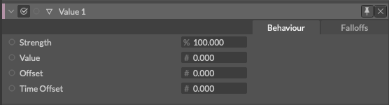

# Value -値-

> バリュー

https://docs.cavalry.scenegroup.co/elements/behaviours/value

値を格納し受け渡しできるシンプルなノードです。

### 共通属性(Common Attributes +)

**Strength** - 強さ。

**Value** - 値。

**Offset** - Valueに対して入力した値を加算/減算します。

**Time Offset** - 任意のアニメーションをオフセットします。

