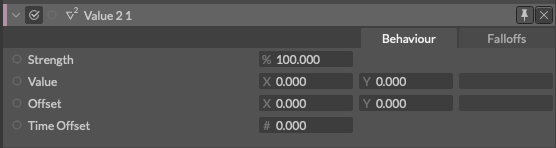

# Value 2 -値x2-

> バリュー ツー

https://docs.cavalry.scenegroup.co/elements/behaviours/value-2

ベクトルを格納し受け渡しできるシンプルなノードです。

### 共通属性(Common Attributes +)

**Strength** - 強さ。

**Value** - [x,y]の値。

**Offset** - Valueに対して入力した値を加算/減算します。

**Time Offset** - 任意のアニメーションをオフセットします。

> Value 2 の出力（ID 接続）はベクトルなので、同じデータ型への接続に使用できます。