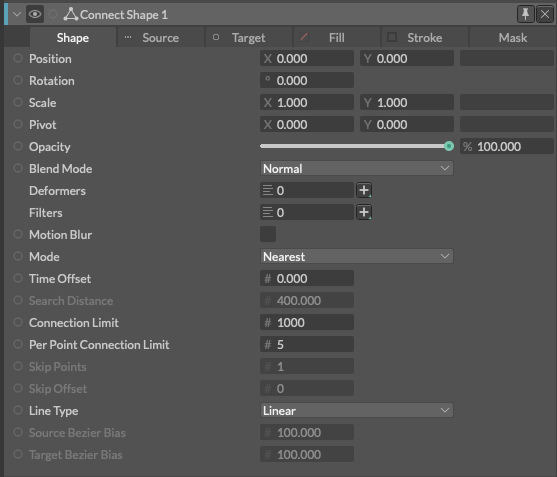
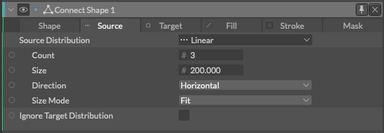
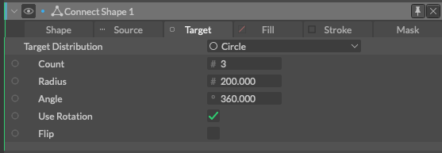

# Connect Shape -接続するシェイプ-

> コネクトシェイプ

https://docs.cavalry.scenegroup.co/elements/shapes/connect-shape

### Shape

### 共通属性(Common Attributes +)

**Mode** - 接続のモードを設定します。

- **Within Range** - ポイントが検索距離内にある場合に接続を作成します。
- **Nearest** - ソース ポイントとターゲット ポイントを最も近いポイントに接続します。
- **Point Index** - ソースのポイントインデックスをターゲットに接続します。

**Time Offset** - このアトリビュートにビヘイビア（Staggerなど）を接続して、接続ライン上のアニメーション（Stroke trimなど）をオフセットします。

**Search Distance** - ポイントがこの距離内にある場合、接続されます(他の設定に依存します)。

**Connection Limit** - 行うことができる接続の最大数を設定します。

**Per Point Connection Limit** - 各ポイントからの接続の最大数を設定します。

**Skip Points** - n 番目のポイントをすべて無視します。

**Skip Offset** - この値でスキップをオフセットします。

**Line Type** - ラインタイプを設定します。

- **Linear** - 直線(ライナー)
- **Bezier** - 曲線(ベジェ)

**Source Bezier Bias** - ソース ポイントの端での曲線の量を設定します。

**Target Bezier Bias** - ターゲット ポイントの端での曲線の量を設定します。

### Source

[Distribution Type](../../USERINTERFACE/General/distributiontypes.md)を設定します。
**Ignore Target Distribution** - チェックを入れると、ソースポイントはターゲットを探すのではなく、お互いに接続します。

### Target

[Distribution Type](../../USERINTERFACE/General/distributiontypes.md)を設定します。