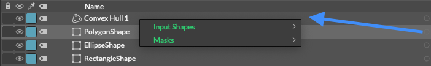
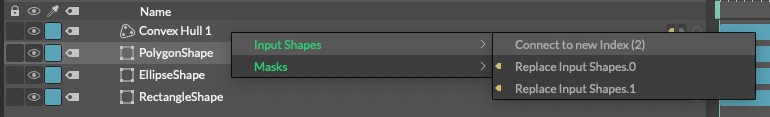
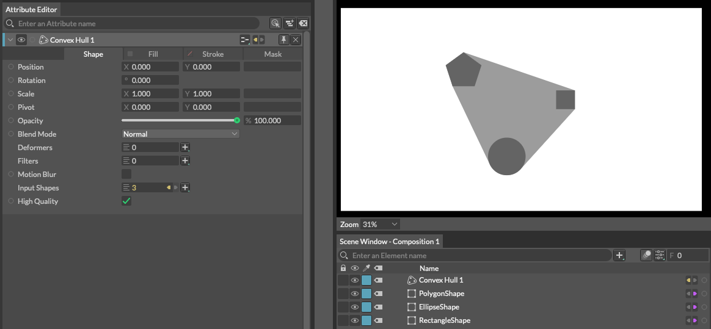
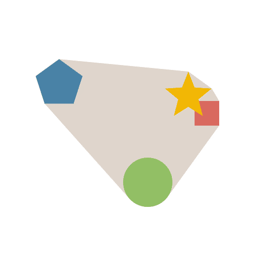

# Convex Hull -凸包-

> コンベックス ホウ

https://docs.cavalry.scenegroup.co/elements/shapes/convex-hull

他のシェイプを包含するシェイプを作成します。

### Common Attributes +

**Input Shapes** - 凸包を描画するためのシェイプを接続します。

**Connect to new Index** - 新しくインデックスを割り振って接続します。凸包の場合２つ（ないし３つ）以上のシェイプがないと効果が得られません。

**High Quality** - 有効にすると、結果として得られるシェイプは、ベジエ曲線や二次曲線を含む入力シェイプをサポートします。

## 使用例

 [convexhull_sample.cv](convexhull.assets/convexhull_sample.cv) 

1. 回転するシェイプ３つと動き回る星型シェイプを作成します
2. **Convex Hull**を作成します。
3. シェイプをConvex Hullの**Input Shapes**に接続します。
4. Hit play.(再生ボタンを押します)

