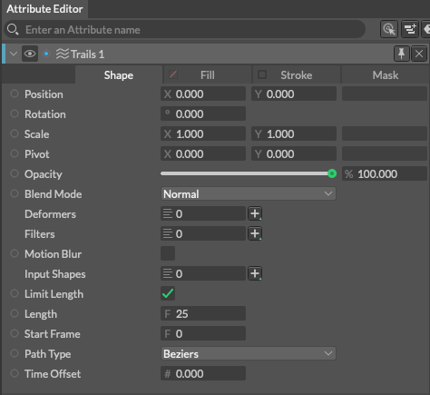

# Trails -軌跡-

> トレイルズ

https://docs.cavalry.scenegroup.co/elements/shapes/trails

シェイプから線（トレイル）を生成します。

### 共通属性(Common Attributes +)

**Input Shapes** - トレイルを生成するwための動くシェイプ(デュプリケーターも可)を接続します

**Limit Length** - チェックを入れると、トレイルの長さの最大長が制限されます。

**Length** - トレイルの最大長を設定します。ただしLimit Lengthにチェックがない場合は無効になります。

**Start Frame** - トレイルが表示される最初のフレームを設定します。

**Path Type** - 生成されるトレイルのsカーブタイプを選択します。

- **Beziers** - ベジェ曲線として生成されます。
- **Lines** - 多角形の線として生成されます。

### 使用例

