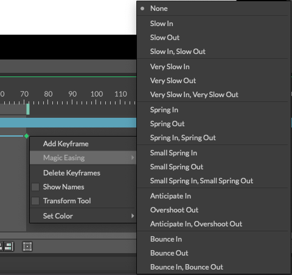

# Time Editor -タイムエディター-

> タイムエディター

https://docs.cavalry.scenegroup.co/user-interface/menus/window-menu/scene-window/time-editor#magic-easing-beta

あなたのタイムラインをアレンジします。

タイムエディターでは、クリップ範囲とアニメーションカーブを調整することができます。

## Playback Range(再生範囲)

緑のプレイヘッドをドラッグしてタイムラインをスクラブします。

再生範囲の開始フレームと終了フレームを設定するには、緑のハンドルをクリックしてドラッグします。開始点と終了点の間にあるバーをクリックしてドラッグすると、再生範囲全体が移動します。

## Visibility Bars(可視性バー)

カーソルが可視化バーの端にカーソルを合わせるとハイライトされます。プレイヘッドがバーの一部を超えるとシェイプが表示されます。ビヘイビアの場合、バーはいつ有効になるかを示しています。

バーは、 Atoms、Filters、Shadersには効果がありません。これらの要素はシェブロン(山形そで章、ギザギザの)バーとして表示されます。FalloffsやNullsのようにビューポートに描画するAtomsはこの規則の例外です。これらは図形と同じように動作します。

### Setting start/end points(開始点と終了点の設定)

複数の要素の開始点/終了点を同時に調整することができます。共通のイン/アウトポイントを共有している要素は、クリック+ドラッグするとハイライトされて移動します。これは、ある要素のインポイントが別の要素のアウトポイントと同じフレーム上にある場合にも当てはまります。
インポイントとアウトポイントの間のバーをクリックしてドラッグすると、可視範囲全体が移動します。

また、コンテクストメニューを使用して、コンポジションや再生範囲、または現在のフレームに基づいて開始/終了ポイントを設定することもできます。

これらのオプションにアクセスするには、以下のようにします。

1. 可視性バーを選択します。
2. 右クリックします。
3. 選択したクリップ範囲/開始/終了の設定] オプションの下にあるオプションのいずれかを選択します。

### 名前を表示する

タイムエディタ内の任意の場所を右クリックし、「名前を表示」にチェックを入れると、その可視性バーに要素の名前が表示されます。

## Keyframes(キーフレーム)

### キーフレームの作成

属性エディタでキーフレームを設定したら、タイムエディタでさらにキーフレームを設定することができます。

そのためには、以下のいずれかを行います。

- プレイヘッドを移動して、アトリビュートの値をスクラブします。
- プレイヘッドを移動し、アトリビュートコントロールのキーフレームアイコンをクリックします。
- キーフレームまたはキーバーを選択し、右クリック > キーフレームの追加。

### キーフレームの編集

キーフレームを編集するには、以下のいずれかの方法があります。

- プレイヘッドを既存のキーフレームと同じフレームに移動し、属性の値をスクラブまたは編集する。
- キーフレームをダブルクリックして、ポップアップコントロールでアトリビュートの値をスクラブまたは編集します。

### キーフレームの移動

キーフレームを移動するには、クリックしてドラッグするだけです。

キーフレームを選択して移動するには、cmd/ctrl + クリック、またはマーキーでキーフレームを選択してドラッグして移動します。また、複数の属性や要素からキーフレームを選択して移動することもできます。

### キーフレームの削除

キーフレームまたはキーフレームを削除するには、以下のいずれかの方法で行います。

- キーフレームまたはキーフレームを選択し、キーボードのDeleteキーを押します。
- キーフレームまたはキーフレームを選択して、右クリック > Delete Keyframe(s)をクリックします。

### キーフレームのコピー

キーフレームをコピーするには、キーフレームを選択し、Edit > Copy Keyframe (cmd/ctrl + C) を選択し、プレイヘッドを移動して Edit > Paste (cmd/ctrl + V) を選択します。同じ属性の複数のキーフレームでも同じことができます。また、あるチャンネルから別のチャンネルへキーフレームデータをコピーすることも可能です。

また、あるElementから別のElementへキーフレームデータをコピーすることもできます。コピーするキーフレームデータが、貼り付け先のElementに既に存在する属性からのものであれば、それらのキーはその属性に追加されます。属性が存在しない場合は、キーフレームデータと一緒に追加されます。

### キーフレームの色付け

キーフレームの色を変更するには、キーフレームまたはキーフレームを選択し、右クリック > 色の設定 > 色を選択します。これは、アニメーションの重要な瞬間を強調するのに便利です。

## Keybars(キーバー)

キーバーは、キーフレームのペアを結ぶ線であり、キーフレームの範囲を選択することなく、アニメーションカーブ全体を移動させるために使用できます。

キーバーは、異なる値の2つのキーフレームの間にある場合、実線で表示されます。キーバーが同じ値の2つのキーを結んでいる場合は、破線で表示されます。これは、要素が静的なままであったり、変更されていない部分を識別するのに役立つように設計されています。

### キーバーの移動

キーバー全体を移動するには、キーバーをクリックしてドラッグするだけです。alt を押したままクリックしてドラッグすると、キーバーの個々のセクションを移動することができます。これは、そのセクションで接続された2つのキーのみを移動させることができます。

> タイムエディタでマーキーを選択する場合、以下の選択ロジックが適用されます。
>
> - 選択範囲内にキーフレームがある場合は、キーフレームのみを選択します。
> - 選択範囲内にキーフレームがない場合は、キーバーを選択します。

## ツール

**Align**(整列) - 選択したキーを互いに整列させます。これは、シェイプを整列させるのと同じように動作します。各属性で選択されたキーの

- **Left** - キーをTimelineの先頭(左)に最も近いキーに配置します。
- **Center** - 中央にキーを配置します。
- **Right** - タイムラインの終わり（右）に最も近いキーにキーを配置します。

**Transform tool**(変形ツール) - このツールを使用して、キーの選択範囲を移動したり、拡大縮小したりすることができます。青いバーの間をクリックしてドラッグすると移動、クリックしてドラッグすると拡大縮小ができます。青いバーをalt + ドラッグすることで、「リップル編集」を実行することもできます。選択されたキーのスケールに合わせて、選択されていないキーをタイムラインに沿ってプッシュします。

**Zoom**(ズーム) - スライダをドラッグして、ウィンドウをズームイン/ズームアウトします。

> また、タイムエディタをズームするには、Alt + マウス/トラックパッドでスクロールするか、タブレットでAlt + ダブルクリック + ドラッグすることができます。

## Magic Easing(マジックイージング) [Beta]

キーフレーム間の数学的補間を適用します。

1. 1つまたは複数のキーフレームを選択します。
2. 右クリック > マジックイージング
3. オプションを選択します。

> 現在のところ、グラフエディタには結果のアニメーションカーブをプレビューするオプションはありませんが、アニメーションメニューのベイクキーフレームアニメーションコマンドを使ってアニメーションをベイクすることができます。

> 注意 - After Effectsユーザーにはあまり馴染みのないかもしれませんが、私たちは近日中に予定されているWebアニメーションの標準的なイージングに従っています。これは公式ページではありませんが、いくつかの素晴らしい例は[こちら](https://easings.net)をご覧ください。W3C Candidate Recommendationsは[ここ](https://www.w3.org/TR/css-easing-1/)で見ることができます。

イージング関数に関する参考URL

http://robertpenner.com/easing/

> ベータ機能は、環境設定ウィンドウでオンにすることができます。

### 使用例

01 None

11 Slow In

12 Slow Out

13 Slow In,Slow Out

21 Very SlowIn

22 Very SlowOut

23 Very Slow In,Very Slow Out

31 Spring In

32 Spring Out

33 Spring In,Spring Out

41 Small Spring In

42 Small Spring Out

43 Small Spring In,Small Spring Out

51 Anticipate In

52 Overshoot Out

53 Anticipate In,Overshoot Out

61 Bounce In

62 Bounce Out

63 Bounce In,Bounce Out

 [magiceasing.cv](timeeditor.assets/magiceasing.cv) 

