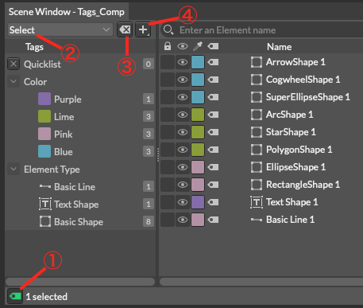
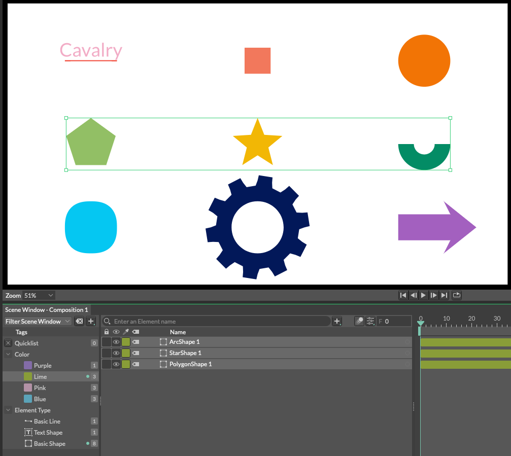
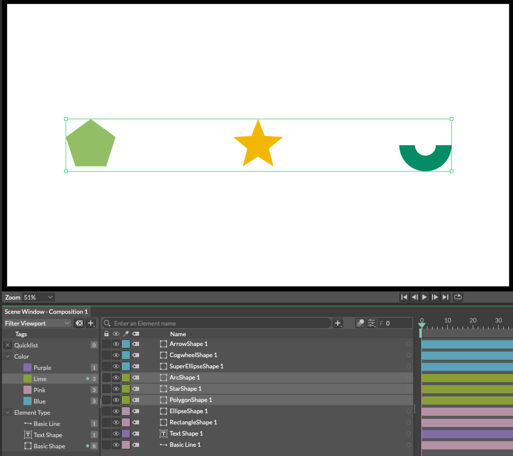

# Tags -タグ-

> タグ

https://docs.cavalry.scenegroup.co/user-interface/menus/window-menu/tags
シーンを整理します。

タグはエレメントに割り当てることができ、素早く選択したり、シーンウィンドウやビューポートをフィルタリングしたりする方法を提供します。また、タグを入れ子にすることで、コントロール性と明瞭性を高めることができます。

[YouTubeチュートリアル](https://www.youtube.com/watch?v=Yx6r5mJXOxI&feature=emb_logo)

## UI(ユーザーインタフェース)

1. **Tags Button** - タグウィンドウを表示します。

2. **Mode(モード)** - タグを選択できます。

- **Selects** - タグウィンドウで選択したタグに割り当てられた要素を、シーンウィンドウとビューポートで選択します。

  

- **Filter Scene Window** - 選択したタグに割り当てられた要素のみをシーンウィンドウで表示します。

  

- **Filter Viewport** - ビューポートで選択したタグに割り当てられた要素のみを表示します。

  

- **Filter Both** - シーンウィンドウとビューポートの両方で、割り当てられたタグを持つ要素のみを表示します。

  

3. **Clear Tag Selection(タグ選択をクリア)** - 選択されたすべてのタグの選択を解除します。

4. **Add Tag(タグを追加)** - 新しいタグを追加します。

## Window(ウィンドウ)

タグウィンドウには3種類のタグがあります。

1. **Quicklist(クイックリスト)** - クイックリストは一時的なタグと考えることができます。その状態は、あなたのシーンでは保存されません。
2. **System Tags(システムタグ)** - **Label Color(ラベルの色)**と**Element Type(要素の種類)**に基づいて自動で割り当てられたタグ。
3. **User Tags(ユーザータグ)** - あなたが作成したタグ。

## Managing Tags(タグの管理方法)

> ユーザータグと何が違う？

### タグの追加・管理

どちらかの方法でタグを追加します。

- **タグウィンドウ上部**にある+ボタンをクリックして、タグの名前を入力し、**Return/Enter**を押します。

- シーンウィンドウで `cmd/ctrl + Shift + t` をクリックすると、**タグの追加ウィンドウ**が表示されます。タグの名前を入力し、**Enter/Return**を押します。
  **Assign Tag to Selection(選択範囲にタグを割り当てる)**をオンにすると、選択した要素にも新しいタグが割り当てられます。

  

> **選択範囲にタグを割り当てる簡単な方法**として、alt/optionキーを押しながら**Return/Enter**キーを押します。これは、チェックボックスが有効かどうかにかかわらず、選択された要素にそのタグを割り当てます。

どちらかの方法でタグを削除します。

- タグを選択して**Delete**キーを押します。
- タグを右クリックし、コンテキストメニューから**Delete Tag(タグの削除)**を選択します。

タグを削除すると、任意の要素からタグの割り当ても解除されます。

### タグの割り当て/解除

いずれかの方法でタグを割り当てます。

- シーンウィンドウのエレメントをタグにドラッグ＆ドロップします。

- タグを追加する際に、**Assign Tag to Selection(選択範囲にタグを割り当てる)**オプションにチェックを入れます。

- シーンウィンドウで**タグ/ラベルアイコン**をクリックして、タグの名前を入力し、**Return/Enter**を押します。

  

どちらかの方法でタグの割り当てを解除します。

- シーンウィンドウの要素を右クリックし、コンテキストメニューから**Remove Tag(タグの除去)**を選択します。
- タグウィンドウでタグを右クリックし、**Clear Tag(タグをクリア)**を選択します。(注意)これはすべての要素からタグを削除します。

### タグをアクティブにする

タグウィンドウでタグを選択するだけで、タグを有効にすることができます。
cmd/ctrl または Shift を使用して、複数のタグを選択および/または選択解除することができます。

> [疑問] 要素をタグにドラッグして割り当てる際に alt/option を押したままにしておくと、マウスを上にしたときにもそのタグが有効になります。

### タグの名称変更

タグの名前を変更するには、タグを選択して**Return/Enterキー**を押すだけです。

### Quicklist

クイックリストは一時的なタグと考えることができます。選択したエレメンツを素早くソロにするための方法として使用できます。その内容はセッション中にのみ保存され、シーンと一緒には保存されません。

クイックリストをタグに変換するには、**タグウィンドウの任意の場所を右クリック**して、コンテキストメニューから**Convert Quicklist to Tag(クイックリストをタグに変換)**を選択します。(Quicklistに何も入っていない時はハイライトされません)

### タグのネスト化(入れ子)

タグを作成時に入れ子にすることで、タグ間の関係を作ることができます。
これを行うには、タグの間に / (Forward Slash) を入力します。(親タグ / 子タグ)

例えば、Character/Body は、Characterと Bodyという 2 つのタグを作成し、Bodyを Characterの子とします。Character(親)を選択すると、Character(親)タグとBody(子)タグの両方が割り当てられたすべての要素が選択され、Body(子)を選択すると本文が割り当てられた要素のみが選択されます。

> キャラクターを設定する際には以下のような階層を作成することができます。
>
> - Character
>   - Head
>     - Hair
>     - Ears
>     - Eyes
>     - Nose
>     - Mouth
>   - Body
>     - Arms
>       - Hands
>     - Legs
>       - Feet
>
> 頭部を選択すると、髪、耳、目、鼻、口を含む頭部全体が表示されます。
>
> [翻訳難しい]Be as granular as you like!

親タグに子を追加する場合は、**(親タグ名) / (新しく作りたい子タグ)**と入力することで子を追加することができます。