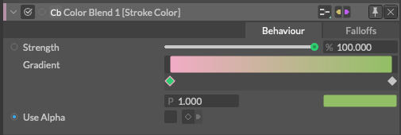

# Gradient -グラデーション-

> グラディエント

https://docs.cavalry.scenegroup.co/user-interface/widgets/gradient

**Position**(P) - グラデーションバーの全ての長さを0から1とした場合、グラデーションが終わる(ストップさせる)位置を数値で入力できます。

**Color** - グラデーションしていく色を指定します。

> グラデーションが終わる(ストップさせる)位置と色をアニメーション化したり、接続したりすることができます。

グラデーションを右クリックすると、以下のオプションが表示されます。

**Distribute Stops** - すべてのグラデーションストップ(アンカー)の幅に均等に分散させます。

**Set Selected** - 選択されたストップ補間を設定します。

- **Set selected to Linear** - あるアンカーからアンカーへの色を直線(リニア)にブレンドします。
- **Set selected to Stepped** - ステップ状に色をブレンドします。

**Set All** -  すべてのアンカーを設定します。

- **Set all to Linear** - 色をあるアンカーから別のアンカーまで直線上にブレンドします。
- **Set all to Stepped** - ステップ状に色をブレンドします。

**Subdivide Gradient** - 今あるアンカーの中間にアンカーを追加します。(細分化)

**Select Same Color** - 選択したアンカーと同じ色のアンカーをすべて選択します。

> Hotkeys(ホットキー)
>
> - グラデーションに沿って任意の場所をクリックすると、新しいストップが追加されます。
> - アンカーをalt/option+クリックでリニアとステップの補間を切り替えることができます。菱形が回転し正方形になります。
> - アンカーをダブルクリックすると、カラーウィンドウがポップアップし、その色を調整することができます。