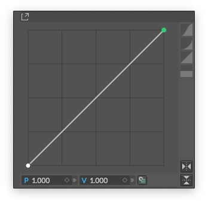
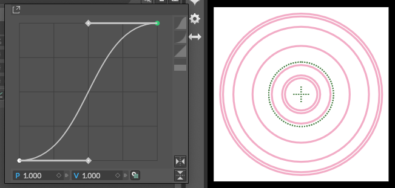
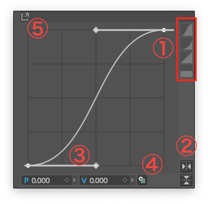

# Graph Attribute -グラフ属性-

> グラフアトリビュート

https://docs.cavalry.scenegroup.co/user-interface/widgets/graph-attribute  

Graph Attribute(グラフ属性)は、Stagger、Falloff、Number Rangeを含むいくつかの要素に見られます。エレメントの効果(ないし数値)をグラフにして使用することができます。

例えば、Falloffの下のようなカーブを描くと、接続されているビヘイビアの「強さ」が変化し、シェイプの位置を通過する際に「オン」から「オフ」へ（そして再び）スムーズに移行します。

グラフの調整は、グラフエディタでアニメーションカーブを操作するのと非常に似ています。

- ポイントをドラッグすると移動できます。
- ait/option＋クリックで、線形からベジエへの補間を切り替えます。
- ハンドルをドラッグするとハンドルを操作できます
- ウィンドウ内の任意の場所をダブルクリックすると、新しいポイントが追加されます。
- ポイントを選択してDeleteキーでポイントを削除します。

1. 右手に沿っていくつかのプリセットカーブがあります。
2. 右下のボタンでグラフを縦横に反転させることができます。
3. 下部の入力ボックスを使って手動で値を入力することもできます。
4. 入力の右にあるボタンを使って Grid Snapping をオンにします。

ここでもポイントやハンドルにアニメーションをつけたり、接続したりすることができます！
ポイントまたはハンドルを選択してから、P（位置）またはV（値）入力との接続をキーフレームまたはドラッグするだけです。

> 接続を行うためには、ウィンドウを永続化(独立)する必要があります。これを行うには、左上の展開アイコン(上図５の矢印)をクリックするか、タイトルバーを掴んでパネルを切り離すように移動するだけです。

